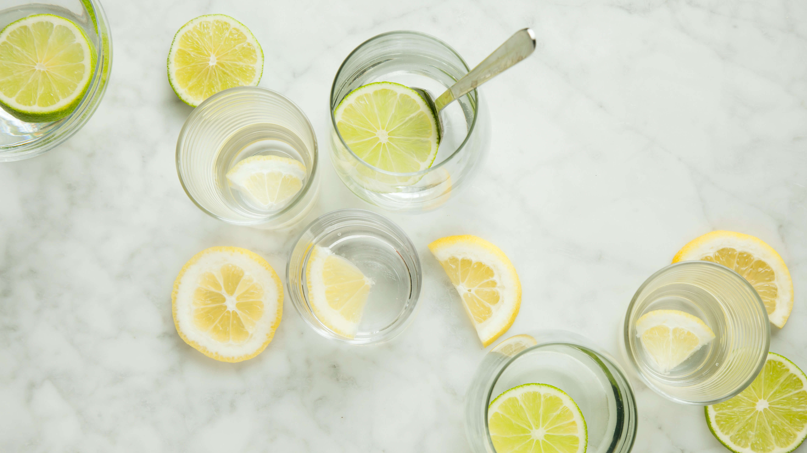
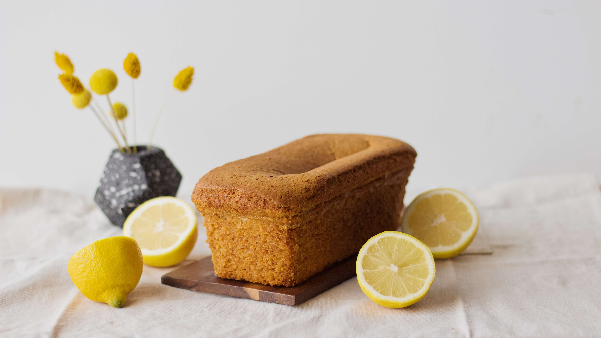
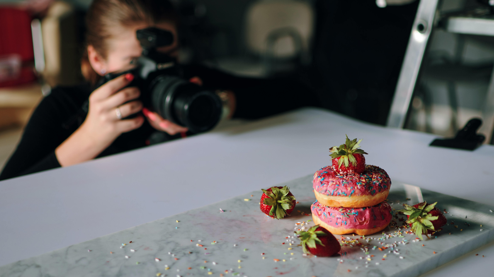
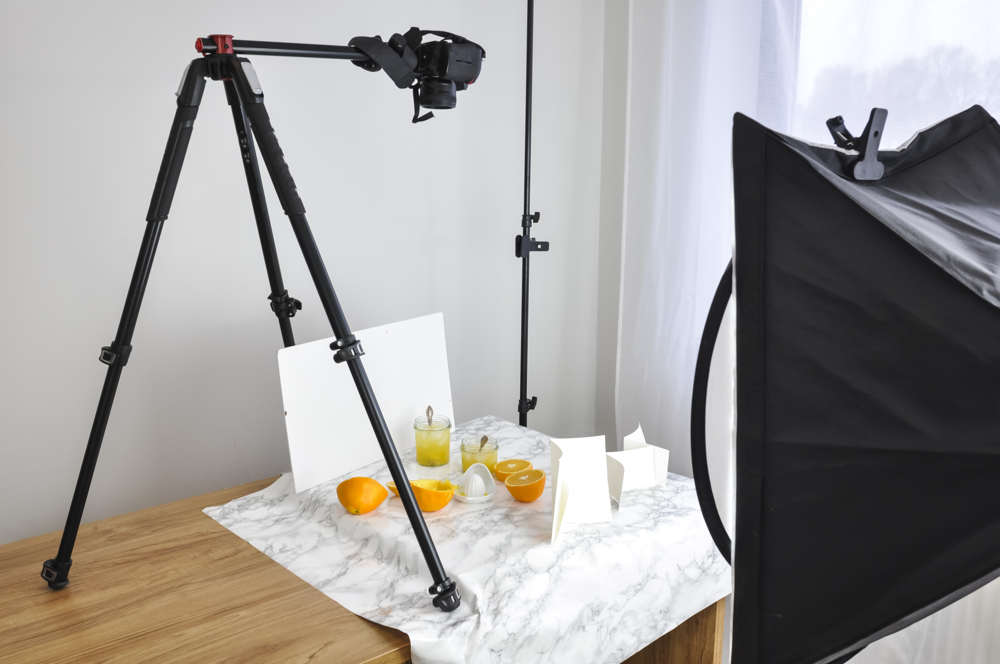
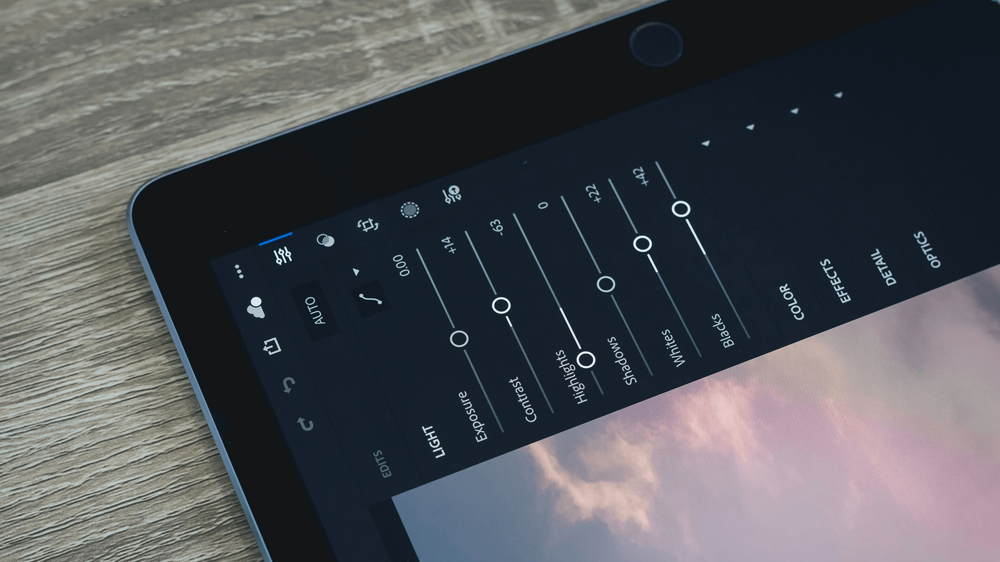
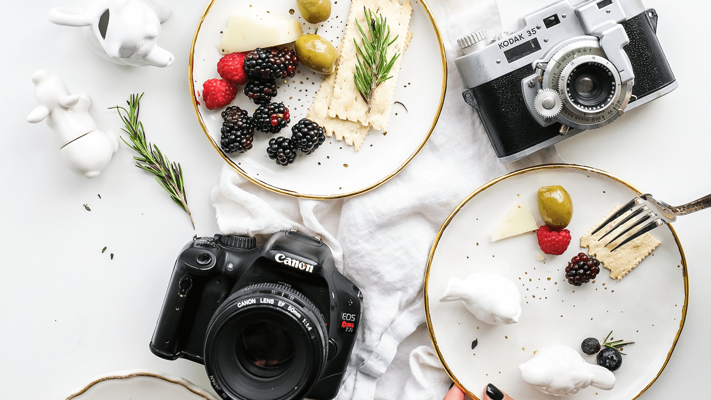

# Vegan food photography tips

## A catering profile filled with high-quality images shows your audience that you're reliable, authentic, and professional.

You don’t need a fancy or expensive camera to take good photos - often your smartphone will do the trick. However, learning some tricks of the food photography trade will set your photos apart no matter what equipment you’re using.

## Basic food photography tips to get you started

### **Use natural light** 

Shooting in natural light brings out colours and harsh shadows and next to a window during the day is a great way to capture natural lighting. Steer clear of overhead lights, lamps or your built-in flash \(please\).

### **Minimize clutter**

Remove all objects inside the frame that don’t support the dish. Fresh ingredients scattered sparingly around the frame works well, however adding cooking utensils or props on top can take the attention away from the dish.

### **Take photos from multiple angles**

Some plates of food look better from above \(like, pizza\), or from the side \(burgers\), or at a 45-degree angle \(drinks\). Try moving around the plate and taking photos at various angles so you can pick your favorite later.

### **Use a tripod**

Keeps your camera steady \(and clean\).

**Edit your photos**

Play around with colour, brightness and white balance to really make the dish ‘pop’. Save your edit presets/settings to use for future photos.

## _Here are some more tips from our favourite creators and platforms!_ 

* Shutterstock: [Photographing Vegan Food: The Growing Trend of Sustainable Dining](https://www.shutterstock.com/blog/vegan-food-photography-tips)
* Happy Cow: [5 Tips for Taking Beautiful Food Photos](https://www.happycow.net/blog/5-tips-taking-beautiful-food-photos/)
* My Vegan Minimalist: [How to improve your food photography - 5 Tips](https://myveganminimalist.com/how-to-improve-your-food-photography/)
* Healthy Little Cravings: [Series of food photography - _blog entries_](https://healthylittlecravings.com/en/category/food-photography)\_\_
* The Little Plantation: [Food Photography Tips - blog entries](https://thelittleplantation.co.uk/food-photography-tips)

## Prefer someone else to do it?

Not a problem! We have a network of professional photographers who are happy to shoot your vegan menu.

Not only are they amazing at their craft, our photography partners also have a strong understanding of vegan ingredients and experience styling vegan food. They have the ‘vegan eye’ 😉.

[Contact us](mailto:hello@vegcraver.com) with your ideas and budget and we’ll put you in touch with a VECGRAVER photographer. 

## Want to elevate your profile to the next level?

Through our production studio Vexquisit, we can create:

* Marketing videos
* Digital content
* Food styling \(prep assistance\)
* Behind the scenes shoots

Wherever your imagination goes, we can meet you there! 

Check out our latest project with [Melanie Joy and Beyond Carnism](https://vexquisit.com/work/beyond-carnism/catch-on-to-carnism).

Email us at hello@vexquisit.com or visit our website [vexquisit.com](https://vexquisit.com/) to book a consultation call.

